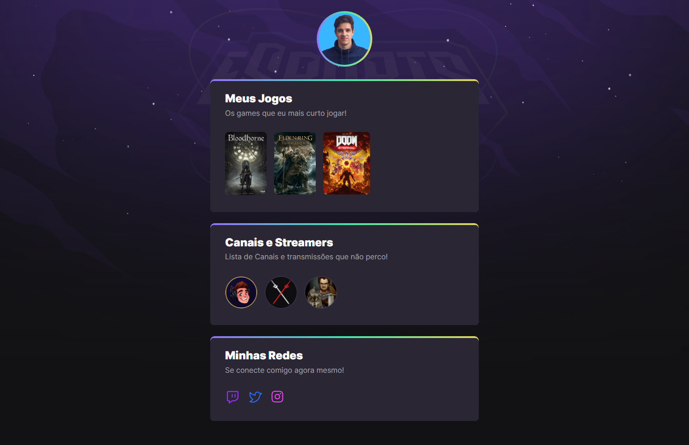

## NLW eSports Projeto Rocket Seat

> Trilha Explorer

[🔗 Clique aqui para acessar](https://souvinivieira.github.io/NLW-eSports-Projeto---Rocket-Seat/)

A idéia era construir um projeto para o evento NLW da Rocket Seat. A proposta deles era que esse projeto fosse construido no período de uma semana enquanto os participantes assistiam algumas aulas para aprimorar as habilidades como dev.

[Link do Evento](https://lp.rocketseat.com.br/nlw)

## O que foi feito?

1 - Conteúdos adicionados no HTML. 
2 - CSS adicionado. 
3 - Animações e Interações Adicionadas.

## 🛠 Tecnologias

- HTML
- CSS
- Git e Github
